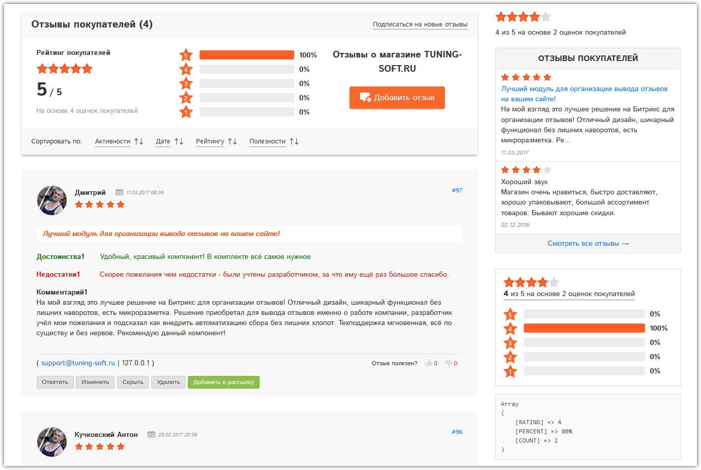
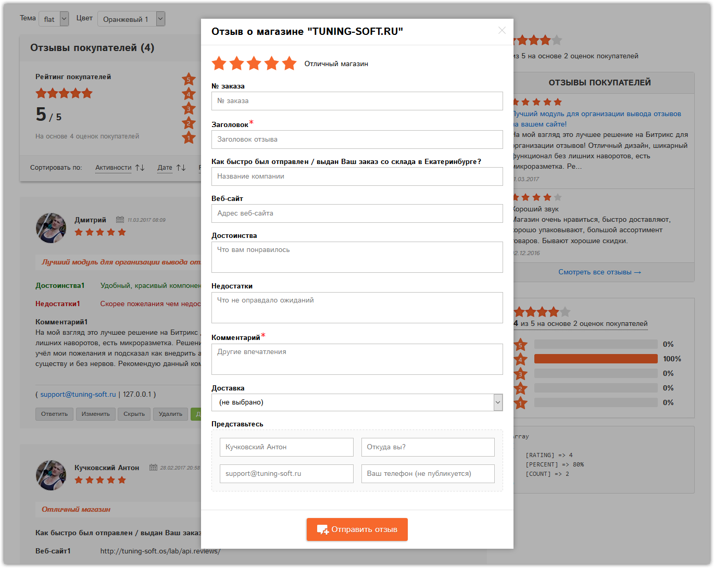
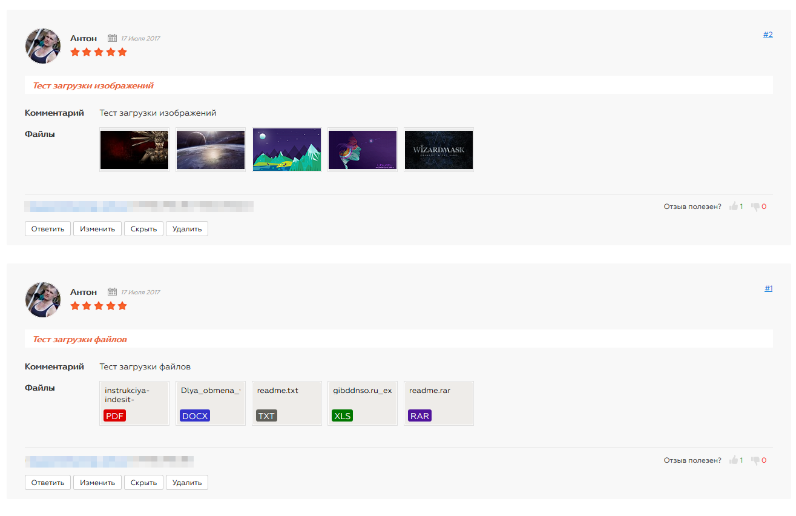

# api.reviews

## TS Умные отзывы (api.reviews)
   TS Умные отзывы о магазине и о товаре дают возможность вашим покупателям оставлять отзывы о магазине и о товаре, комментарии к товарам, отзывы о разделе и даже о странице, с оценкой качества обслуживания и рейтингом товара отдельно для каждого.
   
   В комплекте один комплексный компонент Отзывы, который включает в себя 4-е простых:
   Форма добавления отзыва, Список отзывов, Статистика по отзывам, Сортировка отзывов
   Возможность выбора премодерации (Без модерации, Все, Анонимные);
   Встроенные темы 6 шт. (Оранжевая, Черная, Синяя, Красная, Ярко-голубая, Розовая);
   Возможностьпривязать отзывы к товару, разделу, странице, инфоблоку, заказу по умолчанию без привязки;
   * - Чтобы "Отзывы о товаре" работали в кэше компонентов вам поможет дополнительный модуль Некэшируемая область
   Возможность выбора только необходимых полей для заполнения, все доступные:
   Заголовок, Достоинства, Недостатки, Комментарий, Населенный пункт * , Доставка *, E-mail гостя, Телефон гостя
   * - поля доступны только в редакциях с модулем Интернет-магазин, это редакции Битрикс: Малый Бизнес и выше..
   Возможность задать обязательные для заполнения поля;
   Возможность сортировать отзывы по заданным полям;
   Возможность включить "Замену URL-адресов на ссылки" в полях отзыва и в ответе при выводе списка;
   Возможность выбора всех доставок или только определенных;
   Возможность добавить ссылку на страницу с правилами публикации отзывов;
   Возможность изменять служебные сообщения выводимые покупателю;
   Возможность отключать все встроенные стили компонентов и применять свои;
   Возможность подключить встроенный в Битрикс jQuery;
   Возможность дать официальный ответ на отзыв;
   Возможность отправлять уведомление об ответе на отзыв;
   Встроена наша фирменная скрытая защита от спама без ввода капчи;
   
   
   
   
   